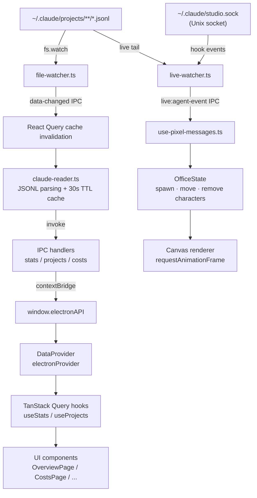
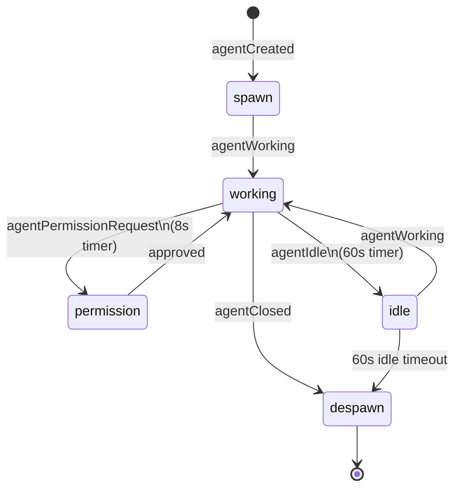

# Claude Studio

Claude Studio is an Electron desktop app for monitoring and analyzing Claude Code usage in real time. It reads JSONL transcripts from `~/.claude/projects/`, turns cost, token, and session data into dashboards, and renders live agent activity as a pixel-art office.

---

## Tech Stack

| Category        | Technology                             |
| --------------- | -------------------------------------- |
| Desktop         | Electron 35, electron-vite             |
| UI framework    | React 19, Tailwind CSS v4, shadcn/ui   |
| Routing / state | TanStack Router v1, TanStack Query v5  |
| Validation      | Zod                                    |
| Charts          | Recharts, framer-motion                |
| Build           | Turborepo, Vite 6, pnpm workspaces     |
| Build targets   | macOS (dmg, universal), Windows (nsis) |

---

## Project Structure

```text
claude-studio/
├── apps/
│   ├── studio/          # Electron desktop app (main + preload + renderer)
│   └── web/             # Vercel-hosted landing page
└── packages/
    ├── ui/              # Shared React UI library (@repo/ui)
    ├── shared/          # Shared types, JSONL parsing, and cost logic (@repo/shared)
    ├── pixel-agents/    # Canvas 2D pixel office engine (@repo/pixel-agents)
    ├── i18n/            # Shared English/Korean localization runtime (@repo/i18n)
    ├── eslint-config/   # Shared ESLint flat config (@repo/eslint-config)
    └── typescript-config/ # Shared TypeScript configuration (@repo/typescript-config)
```

The `apps/studio` Electron app uses a standard 3-tier structure:

```text
src/
├── main/         # Node.js main process (services, IPC handlers)
├── preload/      # contextBridge API exposure (api.ts)
└── renderer/     # React app (TanStack Router file-based routes)
```

---

## Architecture Overview



---

## How It Works

### 1. Data collection

Claude Code writes every message generated during work into JSONL files under:

```text
~/.claude/projects/<encoded-path>/<session-id>.jsonl
```

The directory name is the URL-encoded absolute project path. Example:

`/Users/jb/my-project` -> `-Users-jb-my-project`

Each line is one message (`assistant`, `user`, `tool_use`, `tool_result`, and so on). If a message contains `costUSD`, Claude Studio uses that directly. Otherwise it falls back to model pricing from the shared pricing table.

### 2. Data reading pipeline

```text
~/.claude/projects/**/*.jsonl
    |
    v
claude-reader.ts (packages/shared)
  1. Recursively scan directories
  2. Parse each *.jsonl line
  3. Aggregate sessions and projects
  4. Calculate cost (costUSD first -> pricing.ts fallback)
  5. Return 30-second TTL cached results
    |
    v
IPC handlers -> window.electronAPI -> TanStack Query -> UI
```

Detailed type definitions, cache keys, and formatting helpers live in [`.claude/reference/data-layer.md`](.claude/reference/data-layer.md).

### 3. Live monitoring through two channels

Claude Studio tracks live state through two independent channels.

**Channel 1 - File watcher**

- `services/file-watcher.ts` watches `~/.claude/projects/` with `fs.watch`
- File changes broadcast `data-changed` over IPC
- React Query invalidates relevant caches and refreshes the dashboard

**Channel 2 - Hook server**

- `services/hook-server.ts` listens on the Unix socket `~/.claude/studio.sock`
- The Claude Code plugin (`notify.sh`) forwards hook events such as `PreToolUse`, `PostToolUse`, and `Stop`
- `live-watcher.ts` consumes those events and applies immediate agent state transitions

**Why both channels?**

Watching files alone only sees changes after writes land on disk, which is too late for fine-grained live state. The hook channel captures faster transitions such as permission requests and tool execution boundaries. The system is idempotent: either channel can keep the app functional on its own, but together they provide better fidelity.

### 4. Agent lifecycle



One directory maps to one agent: events coming from the same project directory always route to the same agent identity.

### 5. Plugin system

To forward Claude Code hook events into Studio, the live-monitoring plugin must be installed.

```text
Claude Code CLI
  -> hook event (PreToolUse / PostToolUse / Stop / ...)
  -> notify.sh (plugin)
  -> Unix socket (~/.claude/studio.sock)
  -> hook-server.ts
  -> live-watcher.ts -> live:agent-event IPC
```

The `/data` page manages plugin install and removal from the UI. `services/plugin-installer.ts` creates the hook scripts under `~/.claude/` and updates `settings.json`.

### 6. IPC communication

Claude Studio follows Electron's 3-tier security model:

```text
Main Process (Node.js)
  └── ipc/*.ipc.ts - IPC handlers
        |
        v
Preload (contextBridge)
  └── preload/api.ts - exposes window.electronAPI
        |
        v
Renderer (React)
  └── window.electronAPI.* - typed wrappers
```

**Invoke** (request/response): `getStats`, `getProjects`, `getCostAnalysis`, and related calls  
**Push** (main -> renderer): `data-changed`, `live:agent-event`

Channel definitions and handler mappings live in [`.claude/reference/ipc-and-services.md`](.claude/reference/ipc-and-services.md).

---

## Renderer Structure

`DataProviderWrapper` injects a `DataProvider` implementation via React Context.

- The Electron app uses `electronProvider` (IPC wrappers)
- The web app uses `httpProvider` (REST)

### Main routes

| Path        | Description                                                         |
| ----------- | ------------------------------------------------------------------- |
| `/`         | Overview: cost, token, and session summary with heatmaps and charts |
| `/costs`    | Cost analysis by model, date, and project                           |
| `/projects` | Project list and project detail views                               |
| `/skills`   | Claude Code skill inventory                                         |
| `/data`     | Settings, data source controls, and plugin management               |
| `/live`     | Live pixel office showing agent activity                            |

Route details and fetching patterns live in [`.claude/reference/routing.md`](.claude/reference/routing.md).  
UI component details live in [`.claude/reference/ui-components.md`](.claude/reference/ui-components.md).

---

## Localization Policy

Claude Studio now treats English as the default public language across the product and docs, while keeping Korean as a first-class supported language.

- Public-facing docs and the landing page default to English.
- The Studio interface defaults to English on first launch.
- Korean remains available through a visible in-app language switcher and can be selected immediately from the shell and the `/data` page.
- Language preference is stored per device.
- Internal maintainer references under `.claude/reference/` are intentionally not translated as part of this rollout.

For the rollout details, see:

- [docs/localization/english-default-korean-support.md](docs/localization/english-default-korean-support.md)
- [docs/localization/maintainer-alignment.md](docs/localization/maintainer-alignment.md)

---

## apps/web

`apps/web` is a Vite + React landing page deployed to Vercel. It reuses shared UI components and the shared i18n runtime so the public site matches the product language policy.

---

## Development Setup

Requirements:

- Node.js >= 22
- pnpm >= 10

```bash
pnpm install

pnpm dev
# or run only the desktop app
cd apps/studio && pnpm dev

pnpm build
pnpm lint
pnpm typecheck
pnpm test
```

---

## Internal Reference Docs

The files under `.claude/reference/` are internal reference material for maintainers and AI-assisted development. They are intentionally preserved as-is in this localization effort.

| Document                                                     | Description                                                      |
| ------------------------------------------------------------ | ---------------------------------------------------------------- |
| [coding-rules.md](.claude/reference/coding-rules.md)         | TypeScript, ESLint, dependency, package isolation, and git rules |
| [architecture.md](.claude/reference/architecture.md)         | Monorepo structure, package roles, and data flow                 |
| [tech-stack.md](.claude/reference/tech-stack.md)             | Versioned tech stack details                                     |
| [ipc-and-services.md](.claude/reference/ipc-and-services.md) | IPC channels, services, and agent lifecycle                      |
| [data-layer.md](.claude/reference/data-layer.md)             | Shared types, readers, DataProvider, and parsing details         |
| [routing.md](.claude/reference/routing.md)                   | TanStack Router routes and data-fetching patterns                |
| [ui-components.md](.claude/reference/ui-components.md)       | UI package components, pages, and hooks                          |
| [styling.md](.claude/reference/styling.md)                   | Styling patterns, theme variables, and glassmorphism             |
| [pixel-agents.md](.claude/reference/pixel-agents.md)         | Pixel office engine structure, tiles, characters, and events     |
