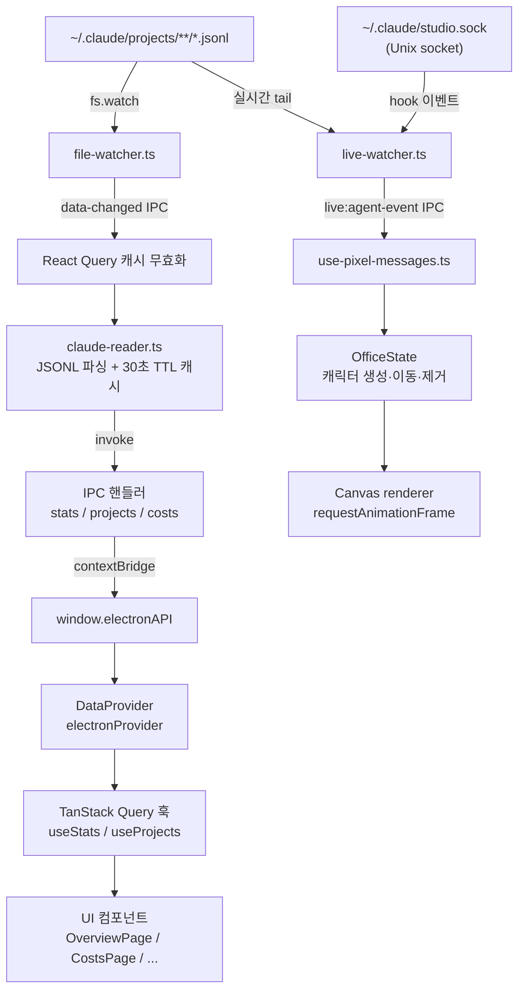
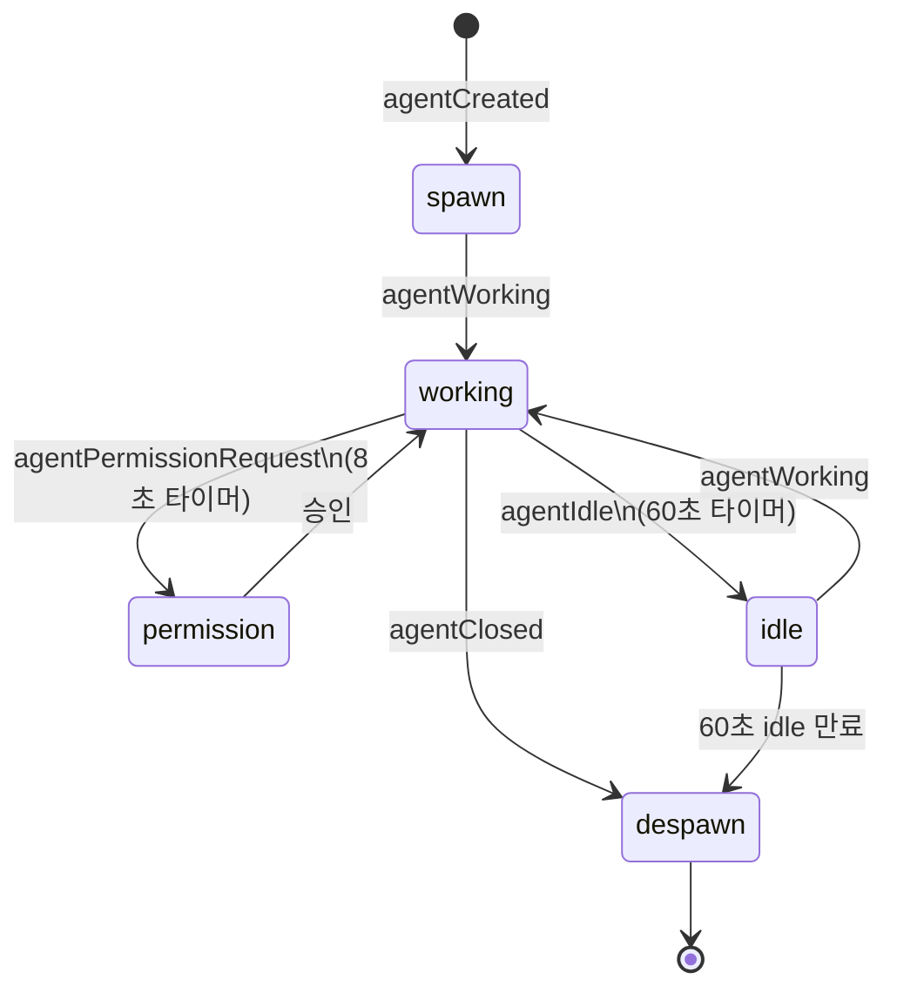

# Claude Studio

Claude Code 사용량을 실시간으로 모니터링하고 분석하는 Electron 데스크톱 앱. `~/.claude/projects/`의 JSONL transcript를 읽어 비용·토큰·세션 통계를 대시보드로 시각화하고, 실시간 에이전트 상태를 픽셀아트 오피스로 표시한다.

---

## 기술 스택

| 카테고리 | 기술 |
|---------|------|
| 데스크톱 | Electron 35, electron-vite |
| UI 프레임워크 | React 19, Tailwind CSS v4, shadcn/ui |
| 라우팅 / 상태 | TanStack Router v1, TanStack Query v5 |
| 데이터 검증 | Zod |
| 차트 | Recharts, framer-motion |
| 빌드 | Turborepo, Vite 6, pnpm workspaces |
| 빌드 타겟 | macOS (dmg, universal), Windows (nsis) |

---

## 프로젝트 구조

```
claude-studio/
├── apps/
│   ├── studio/          # Electron 데스크톱 앱 (main + preload + renderer)
│   └── web/             # Vercel 배포 랜딩 페이지
└── packages/
    ├── ui/              # 공유 React UI 라이브러리 (@repo/ui)
    ├── shared/          # 공유 타입 / JSONL 파싱 / 비용 계산 (@repo/shared)
    └── pixel-agents/    # Canvas 2D 픽셀 오피스 엔진 (@repo/pixel-agents)
```

`apps/studio`의 3-tier Electron 구조:

```
src/
├── main/         # Node.js 메인 프로세스 (서비스, IPC 핸들러)
├── preload/      # contextBridge API 노출 (api.ts)
└── renderer/     # React 앱 (TanStack Router 파일 기반 라우트)
```

---

## 아키텍처 개요



---

## How It Works

### 5.1 데이터 수집

Claude Code CLI는 작업 중 발생하는 모든 메시지를 아래 경로에 JSONL 파일로 기록한다.

```
~/.claude/projects/<encoded-path>/<session-id>.jsonl
```

디렉토리명은 프로젝트 절대 경로를 URL 인코딩한 값이다. 예:
`/Users/jb/my-project` → `-Users-jb-my-project`

각 줄이 하나의 메시지(assistant, user, tool_use, tool_result 등)이며, `costUSD` 필드가 있을 경우 그 값을 사용하고 없으면 모델별 토큰 단가로 계산한다.

### 5.2 데이터 읽기 파이프라인

```
~/.claude/projects/**/*.jsonl
    │
    ▼
claude-reader.ts (packages/shared)
  1. 디렉토리 재귀 탐색
  2. *.jsonl 한 줄씩 파싱
  3. 세션 / 프로젝트 집계
  4. 비용 계산 (costUSD 우선 → pricing.ts 폴백)
  5. 30초 TTL 캐시 반환
    │
    ▼
IPC 핸들러 → window.electronAPI → TanStack Query → UI
```

> 상세 타입·캐시 키·포맷 함수: [`.claude/reference/data-layer.md`](.claude/reference/data-layer.md)

### 5.3 실시간 모니터링 (이중 채널)

Claude Studio는 두 개의 독립 채널로 실시간 상태를 추적한다.

**Channel 1 — File Watcher**
- `services/file-watcher.ts`가 `~/.claude/projects/`를 `fs.watch`로 감시
- 파일 변경 → `data-changed` IPC 브로드캐스트 → React Query 캐시 무효화 → 대시보드 자동 갱신

**Channel 2 — Hook Server**
- `services/hook-server.ts`가 Unix socket `~/.claude/studio.sock`을 리슨
- Claude Code 플러그인(`notify.sh`)이 각 hook 이벤트(PreToolUse, PostToolUse, Stop 등)를 socket으로 전달
- `live-watcher.ts`가 이벤트를 수신해 즉각적인 에이전트 상태 전이를 처리

**왜 이중 채널인가?**
File watcher만으로는 파일이 닫힌 뒤에야 변경을 감지하므로 지연이 발생하고, 개별 tool 호출·permission 요청 같은 세밀한 상태 전이를 추적할 수 없다. 두 채널은 idempotent하게 공존하며, 어느 한 채널만 있어도 기본 동작은 유지된다.

### 5.4 에이전트 라이프사이클



**1디렉토리 1에이전트**: 동일 프로젝트 디렉토리에서 발생하는 이벤트는 항상 같은 에이전트 ID로 라우팅된다.

### 5.5 플러그인 시스템

Claude Code의 hook 이벤트를 Studio에 전달하려면 플러그인 설치가 필요하다.

```
Claude Code CLI
  → hook 이벤트 발생 (PreToolUse / PostToolUse / Stop / ...)
  → notify.sh (플러그인)
  → Unix socket (~/.claude/studio.sock)
  → hook-server.ts
  → live-watcher.ts → live:agent-event IPC
```

`/data` 페이지(설정)에서 플러그인 설치/제거를 UI로 관리할 수 있다.
`services/plugin-installer.ts`가 `~/.claude/` 하위에 hook 스크립트를 생성하고 `settings.json`을 업데이트한다.

### 5.6 IPC 통신

Electron의 3-tier 보안 모델을 따른다.

```
Main Process (Node.js)
  └── ipc/*.ipc.ts — IPC 핸들러
        │  ipcMain.handle (invoke) / ipcMain.emit (push)
        ▼
Preload (contextBridge)
  └── preload/api.ts — window.electronAPI 노출
        │
        ▼
Renderer (React)
  └── window.electronAPI.* — 타입 안전 래퍼
```

**invoke** (요청-응답): `getStats`, `getProjects`, `getCostAnalysis` 등
**push** (main → renderer 단방향): `data-changed`, `live:agent-event`

> 채널 enum 목록·핸들러 파일 매핑: [`.claude/reference/ipc-and-services.md`](.claude/reference/ipc-and-services.md)

---

## Renderer 구조

`DataProviderWrapper`가 React Context로 `DataProvider` 구현체를 주입한다.
Electron 앱은 `electronProvider`(IPC 래퍼), 웹은 `httpProvider`(REST)를 사용한다.

**주요 라우트**:

| 경로 | 설명 |
|------|------|
| `/` | 개요 — 비용·토큰·세션 요약, 활동 히트맵 |
| `/costs` | 비용 분석 — 모델별·일별 비용 차트 |
| `/projects` | 프로젝트 목록 및 상세 |
| `/skills` | Claude Code 스킬 목록 |
| `/data` | 설정 — 데이터 소스, 플러그인 관리 |
| `/live` | 실시간 픽셀 오피스 — 에이전트 시각화 |

> 라우트 상세·데이터 패칭 패턴: [`.claude/reference/routing.md`](.claude/reference/routing.md)
> UI 컴포넌트 목록: [`.claude/reference/ui-components.md`](.claude/reference/ui-components.md)

---

## apps/web

Vite + React 랜딩 페이지. `@repo/ui` 컴포넌트를 재사용하며 Vercel에 자동 배포된다.

---

## 개발 환경 설정

**요구사항**: Node.js >= 22, pnpm >= 10

```bash
pnpm install        # 의존성 설치

pnpm dev            # Electron 앱 개발 서버 (루트에서 실행)
# 또는
cd apps/studio && pnpm dev   # studio만 단독 실행

pnpm build          # 전체 빌드 (Turborepo)
pnpm lint           # ESLint 검사
pnpm typecheck      # TypeScript 타입 검사
pnpm test           # Vitest 유닛 테스트
```

---

## 상세 문서

`.claude/reference/` 하위 문서는 Claude Code 개발 시 참조용 내부 레퍼런스다.

| 문서 | 설명 |
|------|------|
| [architecture.md](.claude/reference/architecture.md) | 모노레포 구조, 패키지 역할, 데이터 흐름 |
| [tech-stack.md](.claude/reference/tech-stack.md) | 기술 스택 버전 정보 |
| [ipc-and-services.md](.claude/reference/ipc-and-services.md) | IPC 채널 enum, 서비스 레이어, 에이전트 라이프사이클 |
| [data-layer.md](.claude/reference/data-layer.md) | shared 패키지, 타입, claude-reader, DataProvider |
| [routing.md](.claude/reference/routing.md) | TanStack Router 라우트, 데이터 패칭 패턴 |
| [ui-components.md](.claude/reference/ui-components.md) | UI 패키지 컴포넌트, 페이지, 훅 |
| [styling.md](.claude/reference/styling.md) | 스타일링 패턴, 테마 변수, glass-morphism |
| [pixel-agents.md](.claude/reference/pixel-agents.md) | 픽셀 오피스 엔진 구조, 캐릭터/타일/이벤트 |
